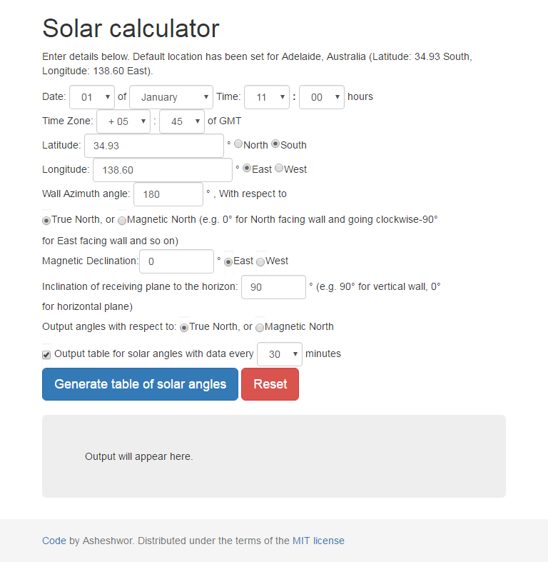

# Solar Calculator - ver 4.0

This script calculates various solar angles like altitude, azimuth, horizontal shadow angle etc. and also gives the value of sunrise time, sunset time, sunrise azimuth angles etc.

The JavaScript code is very old but it still seems to work on modern browsers. It was developed when I was at uni studying architecture for quick solar calculations to aid in designing of shading devices. I still get an email every year or so regarding the code, thus proving that this is still being used (via external sites). I'm sharing the code for those who want to tinker with it.

## Live url

Check it live at [asheshwor.github.io/solar-calculator] (http://asheshwor.github.io/solar-calculator/)

## Screenshot

## History

First version	: 6th August 2000

Last update	: 27th September 2001

Bootstrap framework: September 2016

## License:

Code distributed under the terms of the [MIT license] (https://github.com/asheshwor/solar-calculator/blob/master/LICENSE)

See individual licenses for external tools used if any.

## Attribution:

The latest version uses [Bootstrap] (http://getbootstrap.com/) styling framework.
