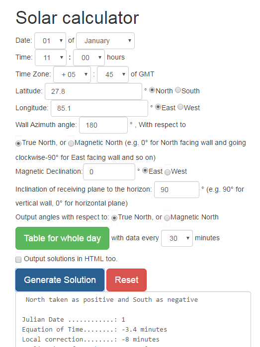

# Solar Calculator ver 4.0

This script calculates various solar angles like altitude, azimuth, horizontal shadow angle etc. and also gives the value of sunrise time, sunset time, sunrise azimuth angles etc.

The JavaScript code is very old but it still seems to work on modern browsers. It was developed when I was studying architecture at uni for quick solar calculations to aid in designing of shading devices. I still get an email every year or so regarding the code, thus proving that this is still being used (via external sites). I'm sharing the code for those who want to tinker with it.

## Demo

[demo at github] (http://asheshwor.github.io/solar-calculator/)

## Screenshot

<small>Screenshot of main page</small>

## History

First version	: 6th August 2000
Last update	: 27th September 2001
Bootstrap framework: September 2016 - incomplete

## License:

License for code: [License file] (https://github.com/asheshwor/solar-calculator/blob/master/LICENSE)

See individual license(s) for external tools used if any.

## Attribution:

Styling framework: [twitter bootstrap] (http://getbootstrap.com/)